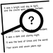

---

---
## Fortran interface to C POSIX regular expressions

This is a Fortran interface to the POSIX 1003.2 regular expression
library using ISO_C_BINDING based on the example in the Fortran wiki.

It adds man-pages and an fpm(1) interface and a unit test.

Volunteers to extend it are welcome

---

---
## BUILDING THE MODULE USING make(1) 
```bash
     git clone https://github.com/urbanjost/M_regex.git
     cd M_regex/src
     # change Makefile if not using one of the listed compilers
     
     # for gfortran
     make clean
     make F90=gfortran gfortran
     
     # for ifort
     make clean
     make F90=ifort ifort

     # for nvfortran
     make clean
     make F90=nvfortran nvfortran
```
This will compile the Fortran module and basic example
program that exercise the routine.

---

---
## BUILD and TEST with FPM

   Alternatively, download the github repository and build it with
   fpm ( as described at [Fortran Package Manager](https://github.com/fortran-lang/fpm) )

```bash
        git clone https://github.com/urbanjost/M_regex.git
        cd M_regex
        fpm test
```

   or just list it as a dependency in your fpm.toml project file.

```toml
        [dependencies]
        M_regex        = { git = "https://github.com/urbanjost/M_regex.git" }
```

---

---
## DOCUMENTATION

### USER
   - A single page that uses javascript to combine all the HTML
     descriptions of the man-pages is at 
     [BOOK_M_regex](https://urbanjost.github.io/M_regex/BOOK_M_regex.html).
   - a simple index to the man-pages in HTML form for the
     [routines](https://urbanjost.github.io/M_regex/man3.html) 
   - There are man-pages in the repository download in the docs/ directory
     that may be installed on ULS (Unix-Like Systems).
   - 
      + [manpages.zip](https://urbanjost.github.io/M_regex/manpages.zip)
      + [manpages.tgz](https://urbanjost.github.io/M_regex/manpages.tgz)

   - [CHANGELOG](docs/CHANGELOG.md) provides a history of significant changes

### DEVELOPER
   - [ford(1) output](https://urbanjost.github.io/M_regex/fpm-ford/index.html).
   - [github action status](docs/STATUS.md) 
<!--
   - [doxygen(1) output](https://urbanjost.github.io/M_regex/doxygen_out/html/index.html).
-->
---
## PEDIGREE

 This is a modified version of the Fortran wiki
 entry [regex_module](https://fortranwiki.org/fortran/show/regex_module)

## SEE ALSO 

   - https://github.com/sage-git/regex-fortran
   - https://github.com/urbanjost/M_match 
   - https://github.com/ZedThree/fortran_pcre 
   - https://github.com/interkosmos/fortran-unix 
   - https://github.com/urbanjost/general-purpose-fortran 
   - https://github.com/vmagnin/gtk-fortran/blob/gtk3/examples/regex.f90 
   - https://swtch.com/~rsc/regexp/ 
   - https://fortran-lang.discourse.group/t/regular-expressions-regex-and-fortran/778 
   - https://github.com/search?q=fortran+regex 
   
   - http://www.pcre.org/ 
   - https://developer.gnome.org/glib/stable/glib-Perl-compatible-regular-expressions.html 
   - https://en.wikipedia.org/wiki/GLib 

---

---
## REFERENCES

   - [Wikipedia](https://en.wikipedia.org/wiki/Regular_expression)
---
